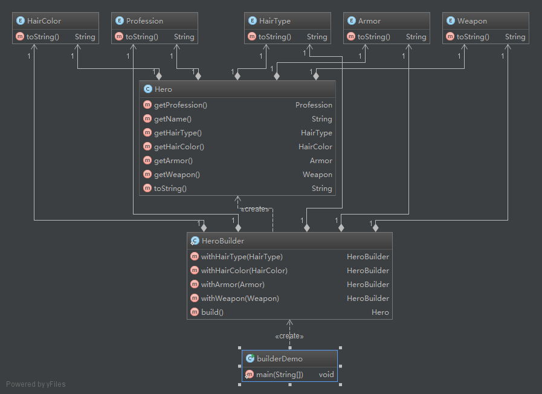

**Intent:** Separate the construction of a complex object from its
representation so that the same construction process can create different
representations.

**Applicability:** Use the Builder pattern when

* the algorithm for creating a complex object should be independent of the parts that make up the object and how they're assembled
* the construction process must allow different representations for the object that's constructed

**Real world examples:**

* [java.lang.StringBuilder](http://docs.oracle.com/javase/8/docs/api/java/lang/StringBuilder.html)
* [Apache Camel builders](https://github.com/apache/camel/tree/0e195428ee04531be27a0b659005e3aa8d159d23/camel-core/src/main/java/org/apache/camel/builder)

**Builder and Abstract Factory**
The Builder design pattern is very similar, at some extent, to the Abstract Factory pattern. That's why it is important to be able to make the difference between the situations when one or the other is used.
 In the case of the Abstract Factory, the client uses the factory's methods to create its own objects. In the Builder's case, the Builder class is instructed on how to create the object and then it is asked for it, 
 but the way that the class is put together is up to the Builder class, this detail making the difference between the two patterns.
 
 **Credits**
 
 * [Design Patterns: Elements of Reusable Object-Oriented Software](http://www.amazon.com/Design-Patterns-Elements-Reusable-Object-Oriented/dp/0201633612)
 * [oodesign](http://www.oodesign.com/builder-pattern.html)
 * [iluwatar](https://github.com/iluwatar/java-design-patterns/tree/master/builder)