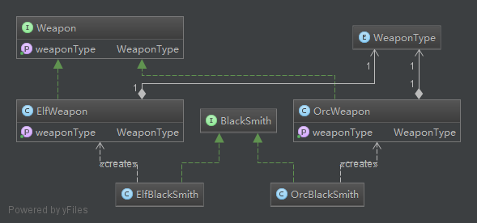

**Also known as:** Virtual Constructor
**Intent:** Define an interface for creating an object, but let subclasses
decide which class to instantiate. Factory Method lets a class defer
instantiation to subclasses.

**Applicability:** Use the Factory Method pattern when

* a class can't anticipate the class of objects it must create
* a class wants its subclasses to specify the objects it creates
* classes delegate responsibility to one of several helper subclasses, and you want to localize the knowledge of which helper subclass is the delegate

**Credits**

* [Design Patterns: Elements of Reusable Object-Oriented Software](http://www.amazon.com/Design-Patterns-Elements-Reusable-Object-Oriented/dp/0201633612)
* [oodesign](http://www.oodesign.com/singleton-pattern.html)
* [iluwatar](https://github.com/iluwatar/java-design-patterns/tree/master/factory-method)