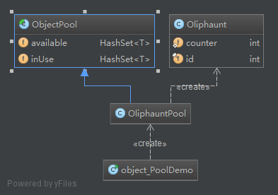

**Intent:** When objects are expensive to create and they are needed only for
short periods of time it is advantageous to utilize the Object Pool pattern.
The Object Pool provides a cache for instantiated objects tracking which ones
are in use and which are available.

**Applicability:** Use the Object Pool pattern when

* the objects are expensive to create (allocation cost)
* you need a large number of short-lived objects (memory fragmentation)

**Credits**
* [oodesign](http://www.oodesign.com/object-pool-pattern.html)
* [iluwatar](https://github.com/iluwatar/java-design-patterns/tree/master/object-pool)
